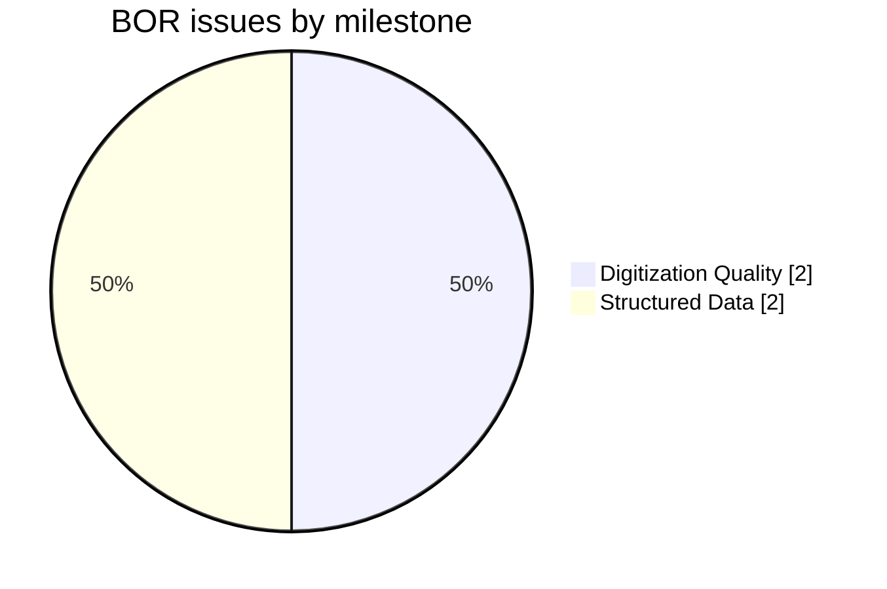
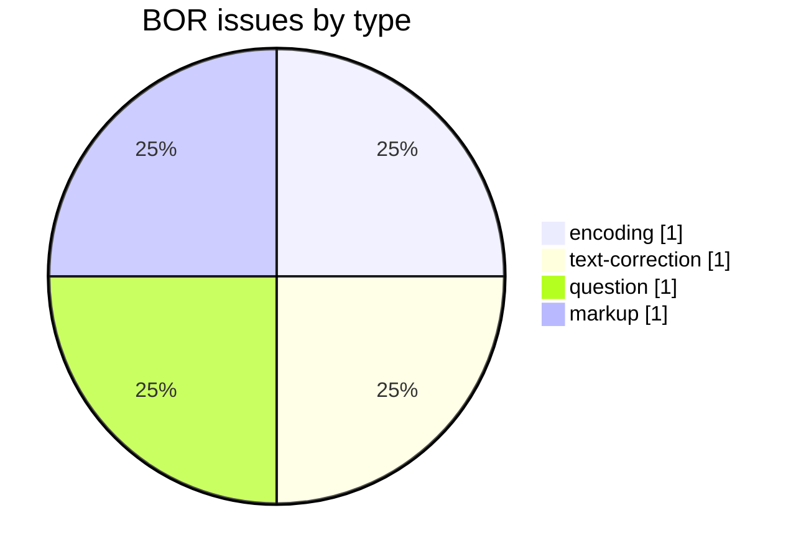
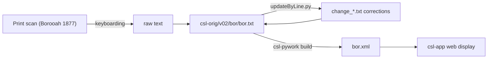

# BOR — Borooah *English-Sanskrit Dictionary*

Development and correction repository for **Anundoram Borooah's *English-Sanskrit Dictionary* (1877)** — an **English→Sanskrit** dictionary (English headwords, Sanskrit glosses), part of the [Cologne Digital Sanskrit Lexicon](https://www.sanskrit-lexicon.uni-koeln.de/) (CDSL). The canonical source text lives in [`csl-orig/v02/bor/bor.txt`](https://github.com/sanskrit-lexicon/csl-orig/blob/master/v02/bor/bor.txt) (24,609 entries); this repository holds correction work.

## Documentation

- [CLAUDE.md](CLAUDE.md) — repository guide, correction workflow, and data-format reference.

## Contents

| Path | Purpose |
|---|---|
| `csl_orig_issue_606/` | Batch correction for csl-orig issue #606: punctuation placement in Devanāgarī |
| `CITATION.cff` | Machine-readable citation metadata |

## Timeline

| Period | Activity |
|---|---|
| 2021-09 | Repository initialized; Devanāgarī punctuation corrections |
| 2026-05 | Issue taxonomy, citation metadata, documentation |

## Projects & Milestones

| Milestone | Open | Closed | Total |
|---|---|---|---|
| Dictionary to Book | 0 | 0 | 0 |
| Digitization Quality | 2 | 0 | 2 |
| Structured Data | 1 | 1 | 2 |
| Major Enhancements | 0 | 0 | 0 |
| **Total** | **3** | **1** | **4** |

## Issues

### Open

| # | Title | Type | Severity | Milestone |
|---|---|---|---|---|
| 1 | comma, semicolon etc inside Devanagari scope | encoding | medium | Digitization Quality |
| 2 | Yj → jY | text-correction | medium | Digitization Quality |
| 3 | BOR possible additional material | question | minor | Structured Data |

### Solved

| # | Title | Type | Severity | Milestone |
|---|---|---|---|---|
| 4 | [markup] Minor bor.txt Markup Oddities | markup | minor | Structured Data |

## Labels

### Type labels
| Label | Meaning |
|---|---|
| `link-target` | Click-throughs from `<ls>` abbreviations to scanned PDF pages |
| `link-splitting` | Splitting combined `SOURCE N,N` refs into per-page links |
| `markup` | Normalising XML tag content |
| `text-correction` | Corrections to English headwords or Sanskrit glosses |
| `content-enhancement` | New material or structural additions beyond correction |
| `encoding` | SLP1/IAST transcoding, character normalisation |
| `scan-quality` | Replacing blurry/skewed/missing scan pages |
| `bug` | Broken links, XML errors, broken downloads |
| `question` | Scholarly questions requiring research |

### Severity labels
| Label | Meaning |
|---|---|
| `minor` | Targeted fix — a handful of lines or a single file |
| `medium` | Standard unit of work — one batch of corrections |
| `hard` | Large effort spanning many sources or files |

## Contributors

| Contributor | Commits |
|---|---|
| Dhaval Patel | 12 |
| Mārcis Gasūns | 2 |

## Source

- **Author**: Borooah, Anundoram
- **Title**: *English-Sanskrit Dictionary*
- **Place / Publisher**: Calcutta
- **Year**: 1877
- **Language pair**: English → Sanskrit (English headwords, Sanskrit glosses)
- **Entries (digital edition)**: 24,609
- **License (digital edition)**: CC BY-SA 4.0
- See [CITATION.cff](CITATION.cff) for machine-readable citation.

## Encoding

- UTF-8 (NFC) throughout.
- English headwords in bold (`{@…@}`); Sanskrit glosses in SLP1; italic display text in ``; sense structure marked with `
`.
- Devanāgarī and IAST are generated at display time, not stored in the source.

## How it works

---
*Issue taxonomy and documentation per the [Cologne issue runbook](https://github.com/sanskrit-lexicon/csl-observatory/blob/main/runbook/cologne-issue-runbook.md).*
