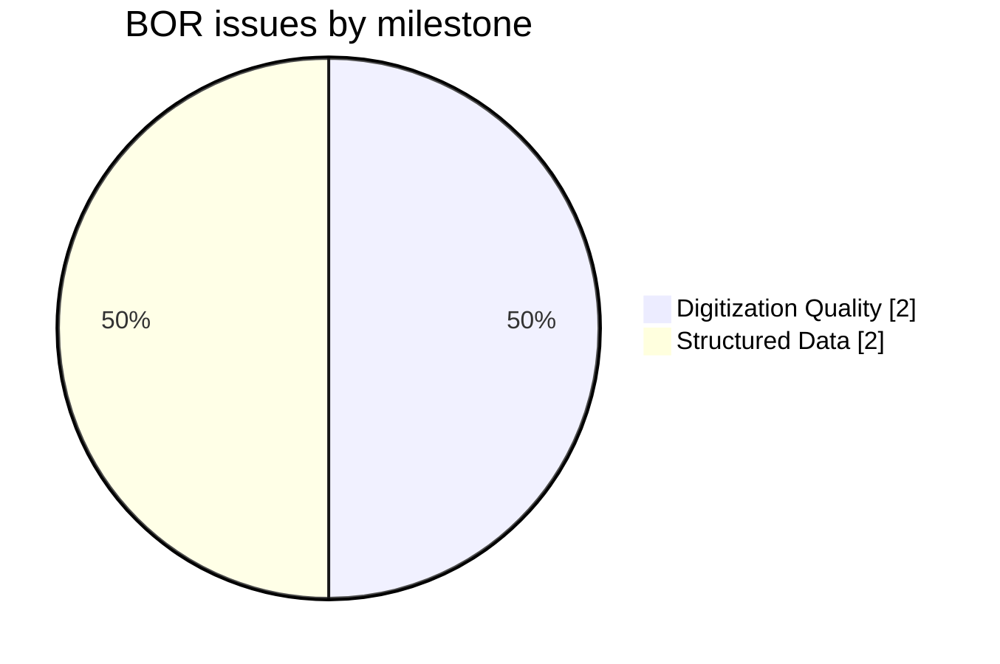
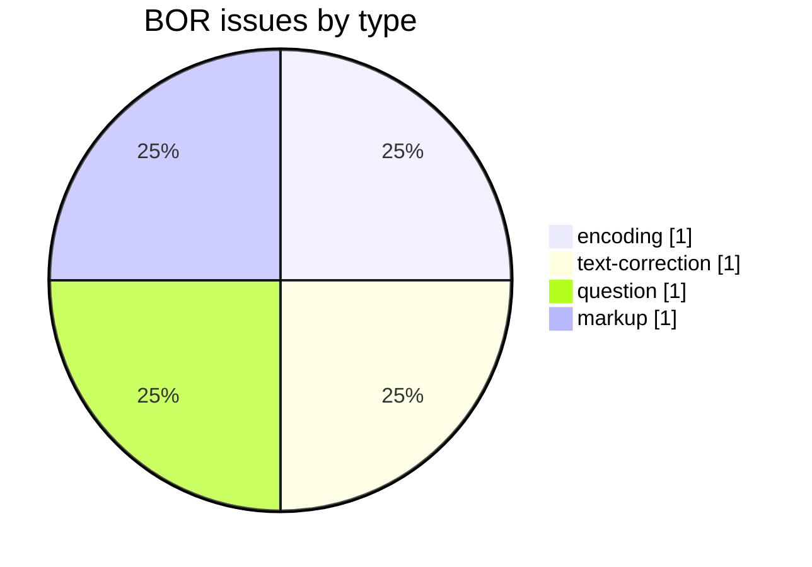
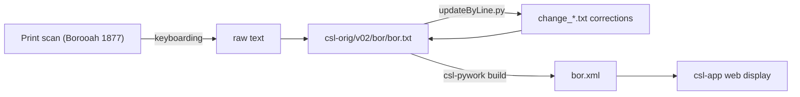

# BOR — Borooah *English-Sanskrit Dictionary*

_Created: 14-09-2021 · Last updated: 14-07-2026_

## Why this repo exists

Anundoram Borooah's 1877 *English-Sanskrit Dictionary* — the one English→Sanskrit dictionary in the [Cologne Digital Sanskrit Lexicon](https://www.sanskrit-lexicon.uni-koeln.de/) (CDSL) collection, 24,609 entries mapping English headwords to Sanskrit glosses — was digitized decades ago from a 19th-century scan, and like every CDSL dictionary it carries digitization-era defects: punctuation misplaced relative to Devanāgarī clusters, markup oddities, encoding errors introduced by the original keyboarding pass. The canonical source lives in [`csl-orig/v02/bor/bor.txt`](https://github.com/sanskrit-lexicon/csl-orig/blob/main/v02/bor/bor.txt), which is deliberately **not** where correction work happens — csl-orig takes only batched, validated PRs, per the canonical [correction workflow](https://github.com/sanskrit-lexicon/csl-corrections/blob/main/docs/correction-workflow.md). This repo is where that correction work is actually done: scripts that detect and fix a specific class of error, an audit trail of every change, and — as of 2026-06 — a faithful OCR + translation of the dictionary's front matter (title pages, prefaces, biography) that never existed in digital form at all.

## Documentation

- [CLAUDE.md](https://github.com/sanskrit-lexicon/BOR/blob/main/CLAUDE.md) — repository guide, correction workflow, and data-format reference.

## Contents

| Path | Purpose |
|---|---|
| [`csl_orig_issue_606/`](https://github.com/sanskrit-lexicon/BOR/tree/main/csl_orig_issue_606) | Batch correction for csl-orig issue #606: punctuation placement in Devanāgarī |
| [`prefaces/`](https://github.com/sanskrit-lexicon/BOR/tree/main/prefaces) | Front-matter OCR (title pages, forewords, prefaces, abbreviation lists, biography & obituaries) + EN/RU — see [Front matter](#front-matter-prefaces) below |
| [`CITATION.cff`](https://github.com/sanskrit-lexicon/BOR/blob/main/CITATION.cff) | Machine-readable citation metadata |

## Timeline

| Period | Activity |
|---|---|
| 2021-09 | Repository initialized; Devanāgarī punctuation corrections |
| 2026-05 | Issue taxonomy, citation metadata, documentation |
| 2026-06 | Front-matter OCR + EN/RU translation of the prefaces ([`prefaces/`](https://github.com/sanskrit-lexicon/BOR/tree/main/prefaces)) |

## Projects & Milestones

Counts below cover the dictionary-correction issues carrying the Cologne taxonomy labels (mechanical/docs issues such as Dependabot bumps and the landing-page task are excluded).

| Milestone | Open | Closed | Total |
|---|---|---|---|
| Dictionary to Book | 0 | 0 | 0 |
| Digitization Quality | 2 | 0 | 2 |
| Structured Data | 1 | 1 | 2 |
| Major Enhancements | 0 | 0 | 0 |
| **Total** | **3** | **1** | **4** |


```mermaid
pie showData
  title BOR issues by milestone
  "Digitization Quality" : 2
  "Structured Data" : 2
```

## Issues


```mermaid
pie showData
  title BOR issues by type
  "encoding" : 1
  "text-correction" : 1
  "question" : 1
  "markup" : 1
```

### Open

| # | Title | Type | Severity | Milestone |
|---|---|---|---|---|
| [1](https://github.com/sanskrit-lexicon/BOR/issues/1) | comma, semicolon etc inside Devanagari scope | encoding | medium | Digitization Quality |
| [2](https://github.com/sanskrit-lexicon/BOR/issues/2) | Yj → jY | text-correction | medium | Digitization Quality |
| [3](https://github.com/sanskrit-lexicon/BOR/issues/3) | BOR possible additional material | question | minor | Structured Data |

### Solved

| # | Title | Type | Severity | Milestone |
|---|---|---|---|---|
| [4](https://github.com/sanskrit-lexicon/BOR/issues/4) | [markup] Minor bor.txt Markup Oddities | markup | minor | Structured Data |

## Labels

### Type labels
| Label | Meaning |
|---|---|
| `link-target` | Click-throughs from `<ls>` abbreviations to scanned PDF pages |
| `link-splitting` | Splitting combined `SOURCE N,N` refs into per-page links |
| `markup` | Normalising XML tag content |
| `text-correction` | Corrections to English headwords or Sanskrit glosses |
| `content-enhancement` | New material or structural additions beyond correction |
| `encoding` | SLP1/IAST transcoding, character normalisation |
| `scan-quality` | Replacing blurry/skewed/missing scan pages |
| `bug` | Broken links, XML errors, broken downloads |
| `question` | Scholarly questions requiring research |

### Severity labels
| Label | Meaning |
|---|---|
| `minor` | Targeted fix — a handful of lines or a single file |
| `medium` | Standard unit of work — one batch of corrections |
| `hard` | Large effort spanning many sources or files |

## Contributors

| Contributor | Commits |
|---|---|
| Mārcis Gasūns | 23 |
| Dhaval Patel | 12 |

## Source

- **Author**: Borooah, Anundoram
- **Title**: *English-Sanskrit Dictionary*
- **Place / Publisher**: Calcutta
- **Year**: 1877
- **Language pair**: English → Sanskrit (English headwords, Sanskrit glosses)
- **Entries (digital edition)**: 24,609
- **License (digital edition)**: CC BY-SA 4.0
- See [CITATION.cff](https://github.com/sanskrit-lexicon/BOR/blob/main/CITATION.cff) for machine-readable citation.

## Encoding

- UTF-8 (NFC) throughout.
- English headwords in bold (`{@…@}`); Sanskrit glosses in SLP1; italic display text in ``; sense structure marked with `<div n="…">`.
- Devanāgarī and IAST are generated at display time, not stored in the source.

## Usage example (verified)

[`csl_orig_issue_606/`](https://github.com/sanskrit-lexicon/BOR/tree/main/csl_orig_issue_606) is a completed correction batch — 141,008 lines of corrected text, 40,315 lines flagged as Devanāgarī-encoding errors. The first real entry in the corrected file, [`bor_corrected.txt`](https://github.com/sanskrit-lexicon/BOR/blob/main/csl_orig_issue_606/bor_corrected.txt), shows the actual markup this repo works with:

```
[Page001]

<L>1<pc>001<k1>a<k2>a
<div n="lb"/>{@A@}¦  (before vowels) AN: <div n="I">I This article
<div n="lb"/>has no equiv. in Sanskrit and is expressed
<div n="lb"/>by the singular number alone: <div n="xe">
<div n="lb"/></div>
<div n="lb"/><div n="xs">{#asti godAvarItIre viSAlaH SAlmalItaruH#}</div> <ls>H.</ls> i.; ...
```

Reading `<k1>a<k2>a` as "headword: *a*", `{@A@}` as the bold English headword, and `{#...#}` as the SLP1-encoded Sanskrit example sentence confirms the format table above against real, committed data (verified by direct file read, not re-run of the correction script — [`shift_punctuation.py`](https://github.com/sanskrit-lexicon/BOR/blob/main/csl_orig_issue_606/shift_punctuation.py) mutates working files in place and was not re-executed here).

## How it works


```mermaid
flowchart LR
  S["Print scan (Borooah 1877)"] -->|keyboarding| R["raw text"]
  R --> O["csl-orig/v02/bor/bor.txt"]
  O -->|updateByLine.py| C["change_*.txt corrections"]
  C --> O
  O -->|csl-pywork build| X["bor.xml"]
  X --> A["csl-app web display"]
```

## Front matter (`prefaces/`)

[`prefaces/`](https://github.com/sanskrit-lexicon/BOR/tree/main/prefaces) holds a faithful Markdown OCR of the **front matter** of Borooah's *English-Sanskrit Dictionary* (the 1971 Publication Board, Assam reprint) together with a Russian translation of every page and consolidated single-file editions. **36 pages** were transcribed: the publisher pages and V. Raghavan's Foreword, the Publication Board's Introduction, Borooah's own two Prefaces (to Volumes I and II), the abbreviation lists, the portrait and Sanskrit benediction, and the three back-of-volume Appendices (Short Biography, Appreciations, Obituaries — printed pages 773–783).

- **Source:** Cologne front-matter index [borpref.html](https://sanskrit-lexicon.uni-koeln.de/scans/csldev/csldoc/build/dictionaries/prefaces/borpref.html); scans under [`_images/`](https://sanskrit-lexicon.uni-koeln.de/scans/csldev/csldoc/build/_images/).
- **File conventions:** `borprefNN.md` (English source, with Devanāgarī/IAST verbatim) and `borprefNN.ru.md` (Russian). The source is English, so there is **no `.en.md`** — the base `.md` is already English.
- **Consolidated editions:** [borpref_all.en.md](https://github.com/sanskrit-lexicon/BOR/blob/main/prefaces/borpref_all.en.md) · [borpref_all.ru.md](https://github.com/sanskrit-lexicon/BOR/blob/main/prefaces/borpref_all.ru.md) — rebuilt reproducibly with [build_combined.py](https://github.com/sanskrit-lexicon/BOR/blob/main/prefaces/build_combined.py).
- **In-folder index:** [prefaces/README.md](https://github.com/sanskrit-lexicon/BOR/blob/main/prefaces/README.md).
- **Signatures / dates:** *Burdwan, May 9th, 1877* and *Goalpara, Oct. 27, 1878* (Borooah's two Prefaces, signed *A.B.*); *V. Raghavan, Madras, 10-2-71*; *Chandra Prasad Saikia, Secretary, Publication Board, Assam, July 1, 1971*.
- **Notes:** the appendix scans jump to filenames `bor_Page_798`…`808`; digitizer/library stamps (the *Universität zu Köln · Institut für Indologie* seal, running headers/footers) are omitted; the Sanskrit benediction (page 25) is reproduced in Devanāgarī and not translated; dense unreadable conjuncts are marked `[?]`.

### OCR run notes (2026-06-23)

> Produced by the `/cologne-preface-ocr` skill (vision OCR + translation subagents). Process retrospective, not part of the deliverable.
>
> **Cost.** Translation subagents (exact, from harness telemetry): 4 agents, ≈252k output tokens, 74 tool calls — EN→RU of pp. 02–08, 09–19, 20–25, 26–36 (each agent wrote its own `.ru.md` files). Main thread (estimate, dominated by the foreground native-resolution crop→read loop over ~25 newly-OCR'd pages plus the resumed pages 01–11): ≈900k–1.0M tokens. **Total ≈1.2 M tokens.**
>
> **Time.** Resumed run; wall-clock ≈55 min. Gated mainly by the gentle one-at-a-time scan download (the Cologne server had just recovered and was dropping connections — page 32 / scan 804 took five retries; pages 26–36 needed their true `_images` filenames discovered from each sub-page's HTML because the manifest's `…_026`-style names 404'd).
>
> **Technical lessons (reusable):**
> 1. The toctree page order ≠ scan filename order: pages 26–36 are `bor_Page_798`…`808` (book pages 773–783), not `…_026`. When `_images/<guessed>.png` 404s, scrape the real `_images/...png` from `borpref/borprefNN.html`.
> 2. Foreground `curl` + a short `sleep` retry loop is the right gentleness for a fragile server; validate the download with the PNG magic `89504e47`, because a 404 returns a ~26 KB HTML error page that passes a naïve size check.
> 3. The early prose pages (vol. I/II prefaces) are noticeably skewed, which scrambles OCR line order within a band — reconstruct paragraph order logically rather than trusting top-to-bottom band reads.
> 4. Abbreviation-list pages are two-column with titles that overrun the column split; crop the left column wider than the visual gutter or titles clip.
> 5. Resume-safe writing (each `.md`/`.ru.md` to disk immediately) meant the already-present pages 01–11 and `borpref01.ru.md` were reused, not redone.

---
*Issue taxonomy and documentation per the [Cologne issue runbook](https://github.com/sanskrit-lexicon/csl-observatory/blob/main/runbook/cologne-issue-runbook.md).*

_Dr. Mārcis Gasūns_
